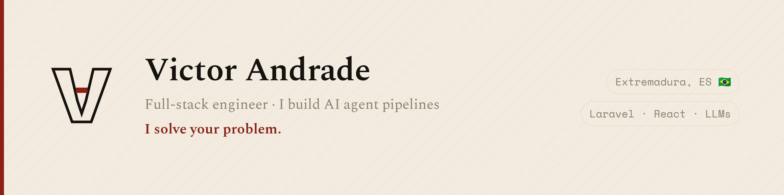

<p align="center">
  
</p>

## `~/victor $ whoami`

Brazilian full-stack engineer based in Badajoz, Spain. I build **AI agent pipelines** — because what matters isn't knowing the commands, it's knowing what to do with them.

I work where product, engineering and AI meet: systems that **automate the boring, not the human**. No magic framework — just architecture and patience.

## What I build

- **End-to-end product** — Laravel + Inertia/React, from the database to the pixel.
- **AI agent pipelines** — systems that plan, execute and review code on their own, with a human at the right gates.
- **Personal automation** — infrastructure that works for me while I sleep.

## Stack

```
backend    Laravel · PHP · Python · MySQL · Redis
frontend   React · Inertia · TypeScript · Tailwind
ai         LLMs · agent pipelines · orchestration
infra      Docker · Vapor/AWS · Linux
```

## Reach me

- ✉️  **victor.andraad@gmail.com**
- 💼  [LinkedIn](https://www.linkedin.com/in/victorandraad)

---

<sub>**I solve your problem.** · vitinho🇧🇷 ↔ Victor Andrade</sub>
